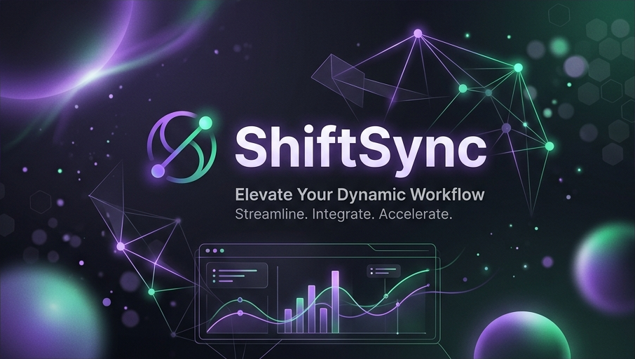

<div align="center">
  
</div>

<div align="center">

[](https://github.com/edycutjong/shift-sync/actions)


[](https://shift-sync-navy.vercel.app)

</div>

# 🚀 ShiftSync - The AI-Powered Data Harmonizer

ShiftSync is a modern, AI-powered tool built to solve one of software engineering's biggest headaches: **intelligent data ingestion and schema mapping**.

**🔗 [Live Demo → shift-sync-navy.vercel.app](https://shift-sync-navy.vercel.app)**

*Built for Hackathon Submission 2026*

## 💡 Inspiration
Data ingestion is notoriously difficult. Every client, vendor, and department sends data in different formats, with different headers, and mixed data types. Developers spend hours writing fragile parsing scripts for every new data source. We wanted to automate this tedious process by combining lightning-fast drag-and-drop file parsing, an interactive node-based UX, and the intelligence of Large Language Models to handle schema mapping instantly. 

## ⚙️ What it does
ShiftSync allows anyone to drag and drop a messy CSV file, parses the data instantly inside their browser, and then uses OpenAI (GPT-4o) to automatically map the disorganized CSV headers to a strict target database schema. 
Any ambiguous or unmapped columns are sent to an interactive mapping graph built with React Flow, allowing developers to visually debug and manually re-map columns before ingestion. It includes robust row validation to discard corrupt data effortlessly.

## 🛠 How we built it
- **Framework:** Next.js 15 (App Router)
- **Styling & UI:** Tailwind CSS (v4), Framer Motion, and custom glassmorphism components
- **AI Integration:** OpenAI API (`gpt-4o-2024-08-06`) leveraging Structured Outputs (Zod) for deterministic mapping
- **Graph Visualization:** React Flow 
- **Parsing & Validation:** PapaParse (client-side chunked parsing) and Zod (schema validation)

## 🤕 Challenges we ran into
- Building a responsive node-graph where visual elements adapt perfectly alongside fluid flexbox layouts.
- Structuring LLM prompts to consistently return deterministic schema mappings instead of conversational text.
- Managing client-side parsing without blocking the main event thread, ensuring the glowing animations remain buttery smooth.

## 🏆 Accomplishments that we're proud of
- The seamless, highly aesthetic "glassmorphism" UI which integrates incredibly complex React Flow nodes into a seamless user experience.
- Moving the burden of schema matching from manual regex and scripting to instantaneous AI matching.
- Achieving a completely serverless architecture that doesn't store sensitive PII user data anywhere during the mapping process.

## 🚀 What's next for ShiftSync
- Supporting custom target schemas input by users (e.g. uploading a `schema.prisma` file directly).
- Real-time data transformation nodes (e.g. a node that splits full names into first/last name).
- Connectors to push mapping pipelines directly to Postgres, Snowflake, or Supabase.

<br />

---

## 💻 Getting Started (For Judges / Developers)

1. **Clone the repository**
2. **Install dependencies**:
   ```bash
   npm install
   ```
3. **Configure Environment Variables**:
   Copy the example environment file and add your OpenAI API key:
   ```bash
   cp .env.example .env.local
   ```
   *You'll need an OpenAI API key (`OPENAI_API_KEY`) for the AI mapping feature to work properly. If it is omitted, the app will gracefully fall back to a hardcoded demo response.*

4. **Run the development server**:
   ```bash
   npm run dev
   ```

5. **Open your browser** to [http://localhost:3000](http://localhost:3000)

## License
This project is open-source and available under the [MIT License](LICENSE).
