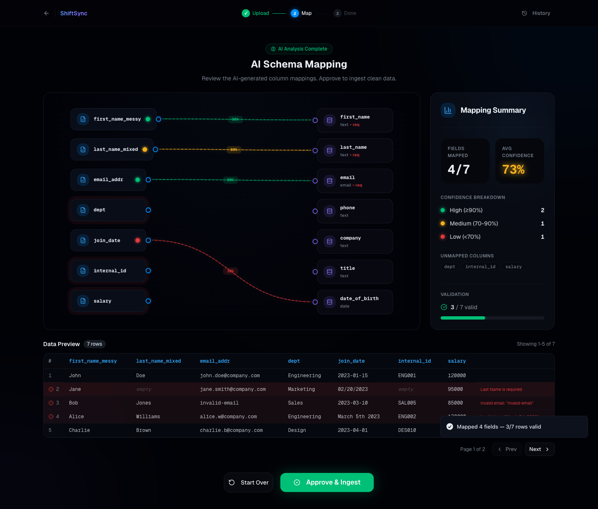
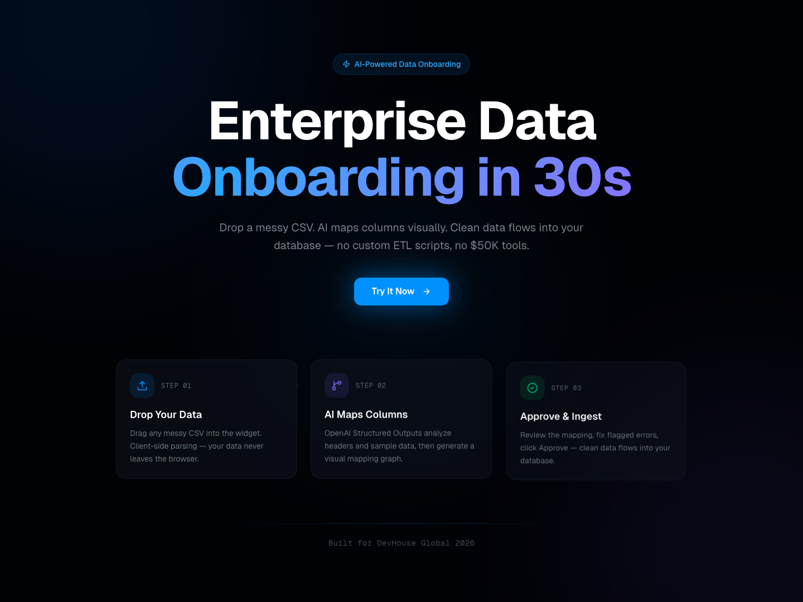
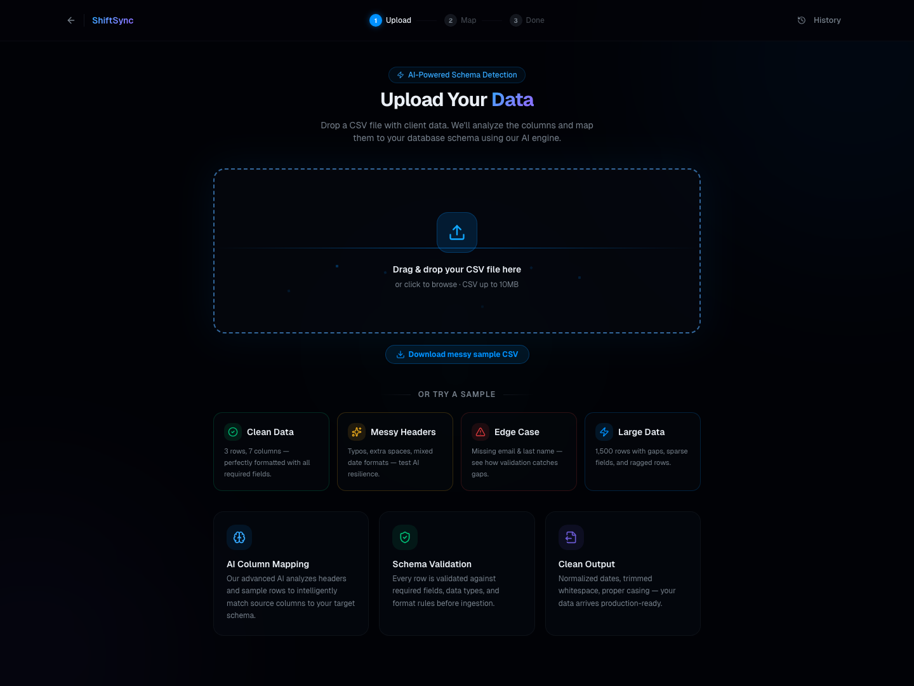
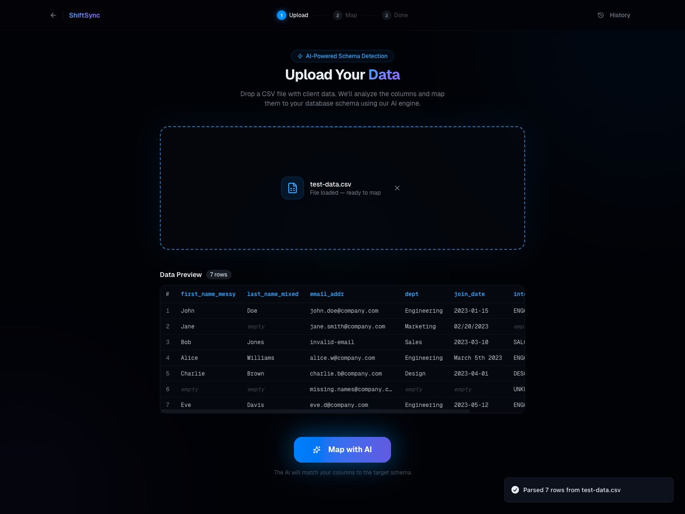
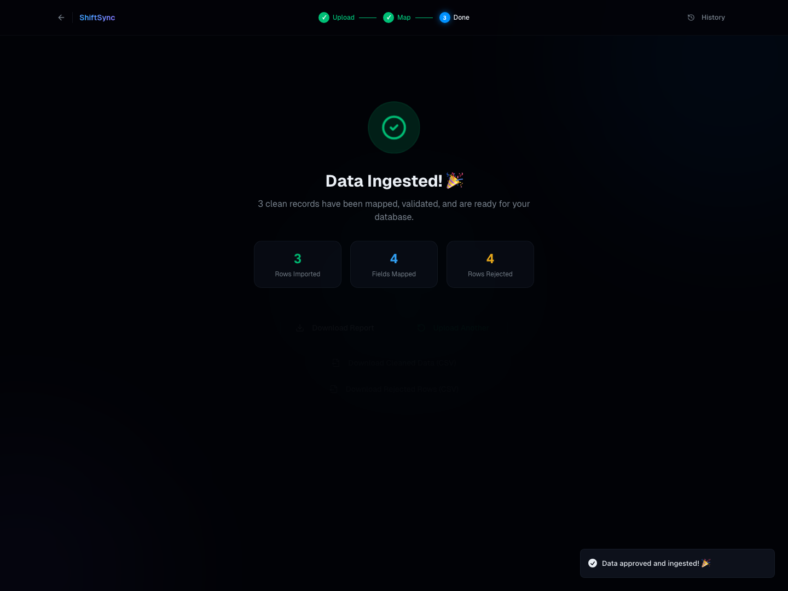

<div align="center">
  
</div>

<div align="center">

[](https://github.com/edycutjong/shift-sync/actions)


[](https://shiftsync.edycu.dev)
[](https://devpost.com/software/shiftsync-axomu5)

</div>

# 🚀 ShiftSync — The AI-Powered Data Harmonizer

ShiftSync is a modern, AI-powered tool built to solve one of software engineering's biggest headaches: **intelligent data ingestion and schema mapping**. Drop a messy CSV, let GPT-4o map your columns visually, and ingest clean data — all inside the browser.

**🔗 [Live Demo → shiftsync.edycu.dev](https://shiftsync.edycu.dev)**

*Built for [DevHouse Global Hackathon 2026](https://devhouse.devpost.com/) · [View Devpost Submission](https://devpost.com/software/shiftsync-axomu5)*

---

## 💡 Inspiration

Data ingestion is notoriously difficult. Every client, vendor, and department sends data in different formats — with different headers, mixed data types, and inconsistent conventions. Developers spend hours writing fragile parsing scripts for every new data source.

We wanted to automate this tedious process by combining **lightning-fast drag-and-drop file parsing**, an **interactive node-based UX**, and the intelligence of **Large Language Models** to handle schema mapping instantly.

## ⚙️ What It Does

ShiftSync allows anyone to:

1. **Drag & drop** a messy CSV file into the widget
2. **Parse** the data instantly — entirely client-side (your data never leaves the browser)
3. **AI maps columns** using OpenAI GPT-4o Structured Outputs to automatically match disorganized CSV headers to a strict target CRM schema with confidence scores
4. **Visually review** the mapping through an interactive React Flow graph — drag to re-map, hover for details
5. **Validate & transform** every row (email validation, date parsing, whitespace trimming, casing normalization)
6. **Approve & ingest** — clean data flows into your database with a full HTML audit report

Any ambiguous or unmapped columns are highlighted in the interactive mapping graph, allowing developers to visually debug and manually re-map columns before ingestion. Corrupt rows are flagged with detailed error messages.

## 📸 See It in Action

<div align="center">
  
</div>

<details>
<summary><b>View More Screenshots</b></summary>
<br/>
<div align="center">
  
  
  
  
</div>
</details>

---

## 🛠 Tech Stack

| Layer | Technology | Version |
|---|---|---|
| **Framework** | Next.js (App Router, Turbopack) | 16.2 |
| **UI Library** | React | 19.2 |
| **Styling** | Tailwind CSS + Framer Motion | v4 / 12.x |
| **Graph Visualization** | @xyflow/react (React Flow) | 12.x |
| **AI Integration** | OpenAI API (GPT-4o Structured Outputs) | 6.x |
| **Schema Validation** | Zod | 4.x |
| **CSV Parsing** | PapaParse (client-side chunked) | 5.x |
| **Component Library** | shadcn/ui + Lucide Icons | — |
| **Testing** | Jest + React Testing Library | 30.x |
| **Deployment** | Vercel | — |

## 🏗 Project Architecture

```
shiftsync/
├── app/
│   ├── page.tsx              # Landing page — animated hero + feature cards
│   ├── layout.tsx            # Root layout, fonts, metadata
│   ├── globals.css           # Design system — glassmorphism, gradients, orbs
│   ├── api/
│   │   └── map/route.ts      # POST /api/map — OpenAI Structured Outputs endpoint
│   └── app/
│       ├── page.tsx           # Main app — Upload → Map → Approve → Ingest flow
│       └── history/           # Ingestion history (localStorage)
├── components/
│   ├── file-dropzone.tsx      # Drag-and-drop CSV uploader
│   ├── data-preview.tsx       # Paginated data table with validation highlights
│   ├── mapping-graph.tsx      # React Flow interactive node graph
│   ├── mapping-node.tsx       # Custom source/target graph nodes
│   ├── mapping-edge.tsx       # Animated confidence-colored edges
│   ├── mapping-summary.tsx    # Sidebar stats — matched, unmapped, missing
│   └── ui/                    # shadcn/ui primitives (Button, Card, Dialog, etc.)
├── lib/
│   ├── schemas.ts             # Target CRM schema + Zod validation schemas
│   ├── parser.ts              # PapaParse wrapper with row padding for ragged CSVs
│   ├── transformer.ts         # Column transforms (trim, lowercase, parse_date, etc.)
│   ├── validator.ts           # Row-level validation against target schema
│   └── utils.ts               # cn() utility
├── scripts/
│   ├── demo.mjs               # Playwright automated demo recorder (screenshots + video)
│   └── test-data.csv          # Sample messy CSV for demo
├── docs/                      # Screenshots and banner assets
├── public/                    # Static assets + sample CSV download
└── .github/workflows/ci.yml   # CI: lint → typecheck → test:coverage
```

### Key Design Decisions

- **Serverless architecture** — No PII data stored. Everything runs client-side except the single AI mapping API call.
- **Graceful AI fallback** — If `OPENAI_API_KEY` is missing, the app uses hardcoded demo mappings. The full UX (upload, graph, validation, export) works perfectly without an API key.
- **Structured Outputs** — Using `zodResponseFormat` with the OpenAI SDK guarantees deterministic, type-safe JSON responses from GPT-4o. No prompt-engineering fragility.
- **100% test coverage** — Every component, utility, and API route is covered by Jest + React Testing Library.

---

## 🤕 Challenges We Ran Into

- **Responsive node-graph layout** — Building a React Flow graph where visual elements adapt perfectly alongside fluid flexbox layouts, with auto-fit on container resize.
- **Deterministic LLM outputs** — Structuring LLM prompts to consistently return schema mappings instead of conversational text. Solved with Zod-based Structured Outputs.
- **Non-blocking parsing** — Managing client-side CSV parsing (including 1,500+ row datasets with sparse/ragged rows) without blocking the main thread while keeping glassmorphism animations buttery smooth.

## 🏆 Accomplishments We're Proud Of

- A seamless **glassmorphism UI** with animated gradient orbs, 3D tilt hover cards, and mouse-follow spotlights — integrating complex React Flow nodes into a truly premium experience.
- Moving the burden of schema matching **from manual regex/scripting to instantaneous AI matching** with confidence scores.
- Achieving a **completely serverless, privacy-first architecture** — no sensitive data is stored anywhere during the mapping process.
- **4 built-in test cases** (Clean, Messy Headers, Edge Case, Large Data) that showcase the engine's resilience without needing your own CSV file.
- A downloadable **HTML Ingestion Report** with full mapping rules, validation audit, and error breakdowns.

## 🚀 What's Next for ShiftSync

- Supporting **custom target schemas** input by users (e.g. uploading a `schema.prisma` or DDL file directly)
- **Real-time transformation nodes** — visual pipeline nodes that split full names, merge columns, or reformat dates
- **Database connectors** to push mapping pipelines directly to Postgres, Snowflake, or Supabase
- **Multi-file ingestion** — batch process multiple CSVs with shared schema rules

<br />

---

## 💻 Getting Started (For Judges / Developers)

### Prerequisites

- Node.js ≥ 18
- npm ≥ 9

### Setup

1. **Clone the repository**
   ```bash
   git clone https://github.com/edycutjong/shift-sync.git
   cd shift-sync
   ```

2. **Install dependencies**
   ```bash
   npm install
   ```

3. **Configure environment** (optional)
   ```bash
   cp .env.example .env.local
   ```
   > **Note:** The `OPENAI_API_KEY` is **optional**. Without it, the app runs in demo mode with built-in mapping rules. Everything works — upload, visual graph, validation, and export.

4. **Run the development server**
   ```bash
   npm run dev
   ```

5. **Open your browser** at [http://localhost:3000](http://localhost:3000)

### Available Scripts

| Command | Description |
|---|---|
| `npm run dev` | Start Next.js dev server (Turbopack) |
| `npm run build` | Production build |
| `npm run lint` | ESLint check |
| `npm run typecheck` | TypeScript type checking |
| `npm run test` | Run Jest tests |
| `npm run test:coverage` | Run tests with coverage report |
| `npm run ci` | Full CI pipeline: lint → typecheck → test:coverage |

---

## 👤 Author

**Edy Cu Tjong** — [GitHub](https://github.com/edycutjong)

## 📄 License

This project is open-source and available under the [MIT License](LICENSE).
